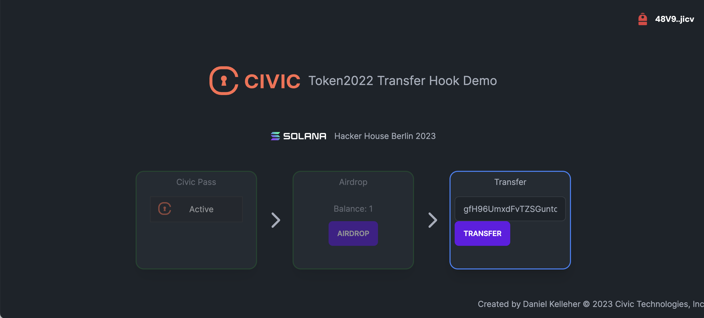

# Civic Pass Transfer Hook

## Get started

### Prerequisites

- Solana v1.6.10+
- Rust v1.52.1+
- Node v18 & yarn v1.22+
- Anchor CLI v0.18.0+

To install Solana:

```shell
sh -c "$(curl -sSfL https://release.solana.com/v1.16.11/install)"
```

To install Anchor:

```shell
cargo install --git https://github.com/coral-xyz/anchor avm --locked --force
avm install latest
avm use latest
```

### Run locally

```shell
yarn
yarn start-local-validator
```

In another shell:

```shell
yarn setup-local
yarn start-demo
```

Go to http://localhost:3000

### Executing the demo



1. Connect a wallet 
2. Get a pass on devnet
3. Click airdrop to receive a token (see the explorer link to show the transaction including the transfer hook CPI)
4. Switch your wallet to a localhost RPC (Backpack supports this). Note for simplicity you can do this after step 2 if needed.
5. Copy some random wallet address (generate a new one with `solana-keygen new --no-outfile --no-bip39-passphrase`)
6. Paste the address into the transfer input and click "Transfer" - should receive an alert saying the user has no pass
7. Run the following command to get a valid recipient address: `solana address -k .permissioned-token/valid-recipient.json`
8. Paste the above address into the transfer input and click "Transfer" - open the explorer to show that the recipient's pass was checked.

Note: Pasting your own address in step 8 will not work, as self-transfers are short-circuited in the program and do not go through the transfer hook.

## Troubleshooting

### If you see:

```platform-tools` 1.16: `cargo build-sbf` error: failed to run custom build command for `blake3 v1.4.0```

Do this: https://solana.stackexchange.com/a/6989

### If you see: 

```
package `time v0.3.25` cannot be built because it requires rustc 1.67.0 or newer, while the currently active rustc version is 1.66.1
```

Do this:
`cargo update -p time@0.3.25 --precise 0.3.23`

### If you see

```
[PageNotFoundError]: Cannot find module for page: /_document
```

Do this:
`rm -r packages/demo/node_modules/.next/`

and then rerun `yarn build`